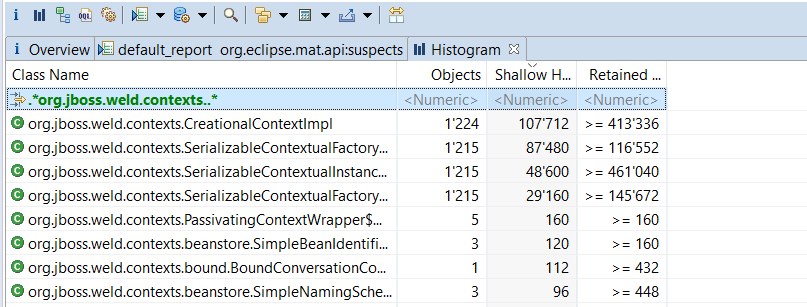
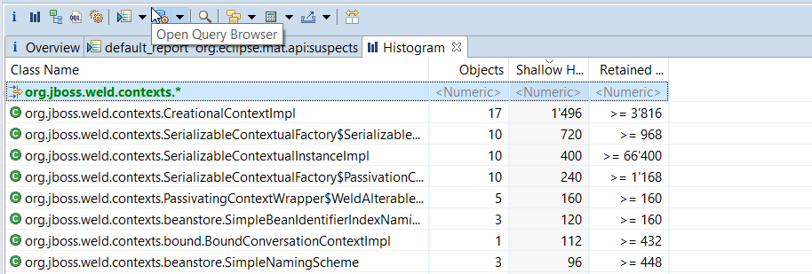

# Wildfly memory leak
This small example project can be used to show a memory leak in the current wildfly versions when using opentracing.
More concrete when using the annotations `@Traced` and `@ApplicationScoped` or `@Stateless` together.

## Affected versions

The following wildfly versions have been tested: 

| Version    |      Leak     |
|------------|:-------------:|
| Wildfly 18 | no
| Wildfly 19 | yes
| Wildfly 20 | yes
| Wildfly 21 | yes

## How to reproduce

Build the war `mvn package` and put it in the container you want.

Run the small load test: `mvn gatling:test`

Check the heap: 

You will find instances of `org.jboss.weld.contexts.CreationalContextImpl` for every request you sent on the heap: 



The Problem occurs when a class is annotated with `@Traced` together with `@ApplicationScoped` (or `@Stateless`).

To play with it use the service class: 

```java

@ApplicationScoped
@Traced
public class HelloWorldService {

    public String sayHello() {
        return "Hello World!";
    }
}

```

Removing the annotations or changing to `@Dependent` solves the issue: 



It's cdi scope dependent.